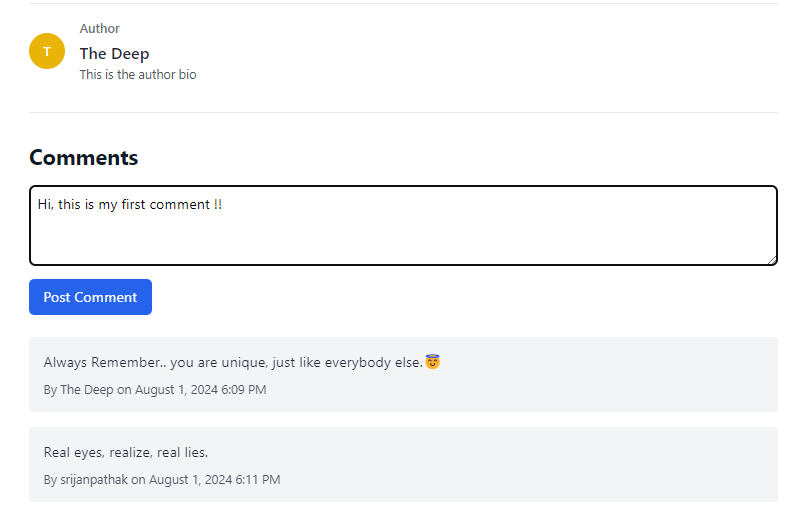

# BLOGR | Serverless Blogging Platform

Welcome to **BLOGR**, a serverless blogging platform designed for scalability and high performance. Built using **Cloudflare Workers**, it ensures 99.99% uptime, secure authentication, and a seamless user experience with robust data management.


## 🚀 Features
- **Serverless Architecture**: Developed using **Cloudflare Workers** to handle blog requests, ensuring scalability and minimal downtime.
- **Secure User Authentication**: Implemented JWT for secure and efficient user authentication and authorization.
- **Data Validation**: Integrated **Zod** for precise data validation and type inference, ensuring data integrity across both frontend and backend.
- **Interactive UI**: Developed a responsive UI using **React.js**, with **TypeScript** for type safety, reducing runtime errors by 50% during deployment.
- **Efficient Data Management**: Utilized **Prisma ORM** with **PostgreSQL** to manage user data and blog posts efficiently.

## 🛠️ Tech Stack
- **Frontend**: React.js, Tailwind CSS, TypeScript
- **Backend**: Hono, Cloudflare Workers, Zod, Prisma, PostgreSQL
- **Authentication**: JWT

## 📸 Screenshots & Functionalities

### 1. Interactive Blog Dashboard

- A responsive and user-friendly interface for managing blog posts, with like, comment and share feature.

### 2. Publish Blog Page

- An intuitive blog creation page where users can write, edit, and publish blog posts.

### 3. Comment Section

- Users can leave comments on blog posts, fostering interaction and discussion.

## ⚙️ Installation & Setup

1. **Clone the repository**
   ```bash
   git clone https://github.com/srijanpathak03/Blogr.git
   cd Blogr
   ```

2. **Install dependencies**
   ```bash
   npm install
   ```
3. **Setup Prisma**
   ```bash
   npx prisma generate
   npx prisma migrate dev
   ```

4. **Environment Variables**

Create a `.env` file in the server directory and add your environment variables:
   ```
   DATABASE_URL=your_postgres_url
   JWT_SECRET=your_jwt_secret
   ```

5. **Run the development server**
   ```bash
   npm run dev
   ```

## 🤝 Contributing

We welcome contributions to **BLOGR**! If you’d like to contribute, feel free to fork the repository and submit a pull request. You can also open issues for suggestions, feature requests, or bugs.

1. **Fork the repository**
2. **Create a new branch**
   ```bash
   git checkout -b feature-branch
   ```
3. **Make your changes**

4. **Commit your changes**
   ```bash
   git commit -m "Describe your changes"
   ```

5. **Push to the branch and open a PR**
   ```bash
   git push origin feature-branch
   ```
   
Contributions to improve the platform are always welcome! ❤️
