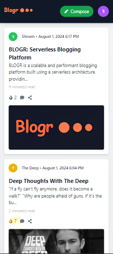

# BLOGR | Serverless Blogging Platform

Welcome to **BLOGR**, a serverless blogging platform designed for scalability and high performance. Built using **Cloudflare Workers**, it ensures 99.99% uptime, secure authentication, and a seamless user experience with robust data management.


## 🚀 Features
- **Serverless Architecture**: Developed using **Cloudflare Workers** to handle blog requests, ensuring scalability and minimal downtime.
- **Secure User Authentication**: Implemented JWT for secure and efficient user authentication and authorization.
- **Data Validation**: Integrated **Zod** for precise data validation and type inference, ensuring data integrity across both frontend and backend.
- **Interactive UI**: Developed a responsive UI using **React.js**, with **TypeScript** for type safety, reducing runtime errors by 50% during deployment.
- **Efficient Data Management**: Utilized **Prisma ORM** with **PostgreSQL** to manage user data and blog posts efficiently.

## 🛠️ Tech Stack
- **Frontend**: React.js, Tailwind CSS, TypeScript
- **Backend**: Hono, Cloudflare Workers, Zod, Prisma, PostgreSQL
- **Authentication**: JWT

## 📸 Screenshots & Functionalities

### 1. Interactive Blog Dashboard

- A responsive and user-friendly interface for managing blog posts, with built-in analytics for tracking performance.

### 2. Publish Blog Page

- An intuitive blog creation page where users can write, preview, and publish blog posts.

## ⚙️ Installation & Setup

1. **Clone the repository**
   ```bash
   git clone https://github.com/srijanpathak03/Blogr.git
   cd Blogr
